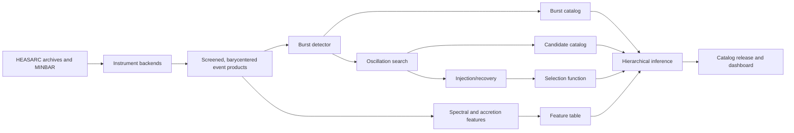

# Burst-Oscillation Accretion Mapper Architecture

Last verified: 2026-05-24

## Purpose

Burst-Oscillation Accretion Mapper is a selection-function-corrected discovery and correlation pipeline for thermonuclear burst oscillations in neutron-star low-mass X-ray binaries. The goal is not to build a generic "500 Hz to 1 kHz peak finder." Burst oscillations are usually close to the neutron-star spin frequency, often in the hundreds of Hz, and the most informative discovery space is usually detectability, fractional amplitude, phase, harmonic content, energy dependence, burst phase, and frequency drift.

The core scientific question is:

> Do accretion state and burst ignition conditions control burst-oscillation detectability, fractional rms amplitude, timing within the burst, harmonic structure, energy dependence, or frequency drift?

The analyzer must therefore treat non-detections as scientifically useful data. A burst without a detected oscillation still contributes an upper limit and a burst-specific sensitivity curve. This is the central design requirement: every candidate or non-candidate must be interpreted through the selection function for that burst, instrument, count-rate envelope, background, search range, and trials penalty.

## System Overview

The pipeline has five primary science products:

1. Burst catalog: source, ObsID, instrument, burst timing, burst morphology, persistent baseline, hardness, flux proxies, and PRE flags where supported.
2. Oscillation-candidate catalog: candidate frequency, time window, power, phase, amplitude, drift model, significance, classification, controls, and sensitivity.
3. Accretion-state feature table: pre-burst persistent flux, hardness ratios, spectral colors, approximate accretion proxy, and color-color position where available.
4. Selection-function model: injection/recovery curves and amplitude thresholds for every burst.
5. Correlation and inference layer: source-aware, instrument-aware, sensitivity-aware models for detection probability, amplitude, and drift.



The first implementation target is RXTE/PCA because it has high count rates, mature archival products, and MINBAR validation data. NICER/XTI is the modern extension after the detector and selection-function machinery are validated.

## Scientific Framing

The primary observables are:

- Detection probability after controlling for photon statistics, source identity, instrument response, exposure, background, burst brightness, search window, and trials.
- Fractional rms amplitude as a function of accretion state, burst phase, energy band, PRE state, and burst morphology.
- Frequency drift parameters rather than absolute frequency alone.
- Oscillation onset phase: rise, peak, early tail, or late tail.
- Harmonic content from `Z_n^2` searches and phase coherence diagnostics.
- Energy dependence of amplitude and phase when count rates support it.

The primary predictors are:

- Pre-burst persistent flux or approximate accretion proxy.
- Hardness ratios and spectral colors.
- Position along a color-color track where measurable.
- Rise time, duration, convexity, decay time, fluence, peak flux, and recurrence time when observed.
- PRE flag, touchdown flux where available, peak blackbody temperature, and cooling-tail behavior where spectra support them.
- Instrument, detector selection, observation mode, background state, and calibration version.

Naive frequency-versus-accretion-rate correlations are not a primary result. Absolute burst-oscillation frequency is often source-stable and spin-linked, so the inference layer should prioritize sensitivity-corrected detection, amplitude, burst phase, and drift behavior.

## Data Backends

Backends provide instrument-specific data access while exposing common event, light-curve, spectral, and provenance products to the rest of the pipeline. These are conceptual interfaces, not yet public Python APIs.

Each backend should provide:

- Observation discovery from source lists, ObsIDs, archive queries, or catalog rows.
- Raw data download or local archive linking.
- Standard screening and GTI application.
- Event extraction with times, energies/channels, detector identifiers, GTIs, and instrument metadata.
- Barycentric correction metadata and corrected event products.
- Background, response, and calibration references where relevant.
- Reproducibility metadata: software versions, CALDB version, screening parameters, detector selections, ephemeris files, and checksums.

### RXTE/PCA Backend

RXTE/PCA is the validation backend and should be implemented first.

Inputs:

- RXTE event-mode or GoodXenon files.
- RXTE/PCA high-time binned Science Array products, when selected validation
  bursts lack paired GoodXenon inputs that can be converted to event files.
- Standard HEASARC products and mission metadata.
- MINBAR burst and observation tables for validation.
- Source ephemerides and literature spin/burst-oscillation frequencies.

Processing:

- Download or link HEASARC ObsIDs for known bursters.
- Extract event lists from high-time-resolution modes when available.
- For high-time binned validation products, expand count bins to
  event-equivalent bin-center times and mark the product provenance as binned.
- Apply GTIs, detector/PCU selection, deadtime-aware count-rate metadata, and energy/channel filters.
- Apply Solar System barycentric corrections with real spacecraft orbit files;
  never use a `GEOCENTER` fallback for burst-oscillation timing validation.
- Apply binary orbital corrections only where reliable ephemerides exist; otherwise
  report an explicit no-ephemeris status.
- Generate event tables, diagnostic light curves, background products, and spectral products where feasible.

Phase 1 validation product selection must stay explicit:

- Prefer barycentered `XTE_SE` event tables.
- Fall back to raw `XTE_SE` event tables and then run barycentric correction.
- Use successful `make_se` outputs only when paired GoodXenon inputs exist.
- Use SingleBit binned products only as a documented Phase 1 validation fallback.

Default RXTE energy bands for burst detection and timing:

- Broad timing band: instrument-appropriate full PCA range after quality cuts.
- Soft color: approximately 2-6 keV.
- Medium color: approximately 6-12 keV.
- Hard color: approximately 12-20 keV.

Notes:

- RXTE/PCA had 2-60 keV coverage and 1 microsecond time resolution according to the HEASARC PCA page.
- MINBAR provides the first validation target because it contains 7083 thermonuclear bursts from 85 sources and includes high-time-resolution oscillation analysis for 950 RXTE/PCA bursts from sources with known burst oscillations.

### NICER/XTI Backend

NICER/XTI should be added after the RXTE detector, search, scoring, and injection/recovery loop have been validated.

Inputs:

- Public NICER ObsIDs from HEASARC.
- NICERDAS/HEASoft-calibrated event files.
- CALDB and mission caveat metadata.
- Background model products and detector configuration data.
- Source ephemerides and literature spin/burst-oscillation frequencies.

Processing:

- Run or ingest NICERDAS standard screening products.
- Track light-leak caveats, detector selection, ISS filtering, undershoot/overshoot cuts, South Atlantic Anomaly filtering, and day/night state where applicable.
- Apply barycentric correction.
- Generate event tables, multi-band light curves, spectra, responses, and background estimates.
- Store calibration version and all screening parameters in observation-level provenance.

Default NICER energy bands:

- Broad timing band: 0.5-10 keV by default, with configurable low-energy cut.
- Soft band: 0.5-2 keV.
- Medium band: 2-5 keV.
- Hard band: 5-10 keV.

Notes:

- HEASARC describes NICER/XTI as a 0.2-12 keV photon-counting instrument with 100 ns time resolution.
- As verified on 2026-05-24, HEASARC says NICER science observations have been suspended since 2025-06-17 while the team investigates pointing-performance degradation. Existing archival data remain valuable.

## Storage Architecture

Use a hybrid storage model:

- Raw archive mirror: immutable references or copies of mission files.
- Processed event products: Parquet or HDF5 for columnar event data and efficient slicing.
- Diagnostic products: FITS, HDF5, PNG, and lightweight JSON summaries as appropriate.
- Science catalog: PostgreSQL for relational joins, provenance queries, candidate review, and dashboard access.

Recommended local product layout:

```text
data/
  raw/
    rxte/{obs_id}/
    nicer/{obs_id}/
  processed/
    events/{instrument}/{obs_id}.parquet
    lightcurves/{instrument}/{obs_id}/
    spectra/{instrument}/{obs_id}/
    bursts/{burst_id}/
    injections/{burst_id}/
  external/
    minbar/
    ephemerides/
  manifests/
    checksums/
    provenance/
```

Processed event tables should include at minimum:

- `time`: mission time or standardized barycentered time, with time system documented.
- `time_raw`: original event time when available.
- `energy` or `pi`: calibrated energy or channel.
- `detector_id`: PCU, MPU, FPM, or equivalent detector identifier.
- `gti_id`: applied good-time interval.
- `obs_id`, `instrument`, `source_id`.
- `barycorr_applied`, `binarycorr_applied`, `correction_ref`.
- `screening_hash`, `caldb_version`, `software_version`.

All derived products must be reproducible from raw inputs plus provenance metadata.

## Conceptual Pipeline Interfaces

The first code implementation should keep these boundaries stable, even if module names change:

- Ingest backend: turns mission-specific archive products into screened, provenance-rich event products.
- Burst detector: turns observation-level event products into burst intervals and burst morphology features.
- Oscillation searcher: turns burst event windows into candidate statistics, dynamic spectra, and controls.
- Injection/recovery runner: estimates burst-specific detection probability across amplitude, frequency, drift, phase, and energy band.
- Feature extractor: computes pre-burst accretion-state features and time-resolved burst spectral/morphology features.
- Candidate scorer: assigns secure, probable, marginal, or null/non-detection classes.
- Inference runner: fits sensitivity-aware hierarchical models.
- Catalog writer: persists products to PostgreSQL and file-backed products.
- Dashboard/export layer: reads catalog products without recomputing science steps.

These are internal architectural contracts. The project should not promise a stable public Python API until the RXTE MVP and selection-function loop are proven.

## Burst Detection

The burst detector should begin with robust statistics, not deep learning.

Light-curve preparation:

- Bin events at 0.125 s, 0.25 s, and 1.0 s.
- Build broad-band and energy-resolved light curves.
- Estimate a local persistent baseline with rolling robust statistics, excluding candidate flares and known bad intervals.
- Use pre-burst windows when available, such as -200 s to -20 s relative to burst start.
- Carry uncertainty from background, detector selection, and deadtime corrections where available.

Detection method:

- Poisson generalized likelihood ratio test against local persistent baseline.
- Matched filters with fast-rise and slower-decay burst templates.
- Morphology filters requiring fast rise and slower decay.
- Hardness evolution checks to reject particle flares, dips, occultation artifacts, telemetry artifacts, and non-thermonuclear events.
- MINBAR matching for RXTE validation.

Burst detector outputs:

- `burst_start`, `burst_peak`, `burst_end`.
- `rise_time`, `decay_tau`, `duration_t90`.
- `peak_count_rate`, `fluence_counts`, `preburst_rate`.
- `hardness_preburst`, `hardness_evolution`.
- `burst_confidence`.
- `morphology_class`: short, long, PRE candidate, superburst candidate, marginal, or rejected.
- `validation_ref`: MINBAR row or manual review note where available.

## Oscillation Search

The oscillation search is the scientific core. It must operate on event data, maintain trials accounting, and produce controls for every candidate.

Preprocessing per burst:

- Extract events from approximately `burst_start - 20 s` to `burst_end + 50 s`.
- Apply barycentric correction if not already present.
- Apply binary orbital correction where a reliable ephemeris exists.
- Split by configured energy bands.
- Create control intervals from pre-burst, post-burst, neighboring non-burst data, and synthetic Poisson event streams with the same burst count-rate envelope.

Search modes:

- Targeted search for sources with known spin or known burst-oscillation frequency. Search around the expected frequency using source-specific ranges when available, otherwise start with configurable +/-5 Hz and +/-10 Hz bands.
- Blind search for sources without known burst oscillations. Search broad exploratory ranges such as 20-2000 Hz, but report these separately because their trials penalty is much larger.

Timing statistics:

- Event-based Rayleigh / `Z_1^2` tests.
- `Z_n^2` tests for harmonic content.
- Leahy-normalized FFT power as a diagnostic.
- Dynamic power spectra for review and visualization.
- Matched frequency-drift templates.
- Empirical false-alarm estimates from controls and synthetic intervals.

Windowing:

- Use 0.25 s, 0.5 s, 1 s, 2 s, 4 s, and 8 s windows.
- Slide windows across rise, peak, early tail, and late tail.
- Store the exact window grid, overlap policy, energy band, and search range because they define the trials count.

Candidate outputs:

- Time window start and stop.
- Frequency, frequency uncertainty, and search mode.
- `Z_n^2` statistic and harmonic order.
- Leahy power diagnostic.
- Fractional rms amplitude and uncertainty.
- Pulse phase and phase uncertainty.
- Energy band and number of photons.
- Single-trial p-value.
- Trials-corrected p-value.
- Empirical false-alarm probability.
- Dynamic-spectrum review assets.
- Candidate class.

## Frequency Drift Modeling

Frequency drift should be modeled for detections and strong candidates because it is likely more informative than absolute frequency alone.

Initial model family:

- Constant frequency: `nu(t) = nu0`.
- Linear drift: `nu(t) = nu0 + nudot * t`.
- Exponential approach: `nu(t) = nu_inf - dnu * exp(-t / tau)`.
- Quadratic drift: `nu(t) = nu0 + a1 * t + a2 * t^2`.

Saved drift outputs:

- Initial frequency.
- Asymptotic or final frequency.
- Total drift.
- Drift rate or timescale.
- Coherence.
- Phase residuals.
- Preferred model and model comparison score.
- Failure mode when no stable drift model is justified.

The search should avoid overfitting marginal candidates. Drift parameters should be promoted to inference only for secure and selected probable detections, with marginal detections retained for sensitivity and review.

## Candidate Scoring

Scoring must be conservative and reproducible.

Secure detection:

- Trials-corrected significance passes the configured threshold.
- Candidate appears in a physically plausible burst phase.
- Candidate is absent from pre-burst and non-burst controls.
- Frequency is consistent with known spin/burst frequency or survives the blind-search trials penalty.
- Injection/recovery shows adequate sensitivity for the inferred amplitude.
- Dynamic spectrum shows coherent structure.
- Phase evolution is not random.

Probable detection:

- Strong signal with plausible burst timing and frequency behavior.
- Some penalty, sensitivity, or control limitation prevents secure classification.
- Suitable for candidate tables and secondary analyses, not primary claims unless predeclared.

Marginal candidate:

- Interesting but not significant enough for primary inference.
- Preserved for review, future data, and reproducibility.
- Excluded from primary population-level detection claims.

Non-detection:

- No accepted candidate in the configured search.
- Still stores amplitude upper limits and injection/recovery sensitivity.
- Included in hierarchical detection and censored-amplitude inference.

## Selection Function

Selection-function correction is required, not optional. It is what prevents count rate, exposure, instrument, background, burst brightness, and search-range differences from masquerading as astrophysical correlations.

For every burst, run injection/recovery through the same search and scoring code used for real candidates.

Injection dimensions:

- Fractional rms amplitude.
- Frequency or source-specific frequency offset.
- Frequency drift model and parameters.
- Burst phase: rise, peak, early tail, late tail.
- Energy band.
- Count-rate envelope.
- Instrument and detector selection.
- Background state.

Outputs:

- 50%, 90%, and 95% detectable amplitude thresholds.
- Detection probability curve as a function of amplitude.
- Sensitivity maps across frequency, drift, burst phase, and energy band when count rates allow.
- Upper limits for non-detections.
- Recovery bias estimates for amplitude, frequency, phase, and drift.

Injection/recovery products should be versioned by pipeline version and search configuration. If the search grid changes, sensitivity products must be regenerated.

## Spectral And Accretion-State Features

Feature extraction should distinguish pre-burst accretion state from burst spectral evolution.

Pre-burst interval:

- Default: -200 s to -20 s relative to burst start.
- Shorter fallback windows allowed when GTIs or observation boundaries require it.
- Store actual interval, exposure, background model, and quality flags.

Pre-burst features:

- Persistent count rate.
- Background-corrected flux where spectra are reliable.
- Hardness ratios.
- Spectral colors.
- Approximate accretion proxy.
- Color-color coordinates.
- Fractional position along atoll track where source coverage supports it.

Burst spectral features:

- Time-resolved blackbody temperature `kT_bb`.
- Apparent blackbody radius `R_bb`.
- Bolometric flux and fluence.
- PRE flag and confidence.
- Touchdown flux if PRE is detected.
- Cooling-tail slope.
- Spectral fit quality and model version.

Burst morphology features:

- Rise time.
- Convexity.
- Decay time.
- Duration.
- Peak flux.
- Fluence.
- Recurrence time if previous burst is observed.
- Alpha ratio if persistent fluence between bursts is measurable.
- Morphology class: short helium-like, long mixed H/He-like, PRE, superburst candidate, marginal, or rejected.

RXTE should leverage MINBAR features when available, while still storing whether a value is imported, recomputed, or unavailable.

## Correlation And Inference Layer

The inference layer should be hierarchical because bursts are nested in sources and observed with different instruments and sensitivities.

Detection model:

```text
P(D_i = 1) = logit^-1(
    alpha_source[s_i]
  + beta_fpers * log(F_pers_i)
  + beta_hardness * hardness_i
  + beta_pre * PRE_i
  + beta_rise * rise_i
  + beta_counts * log(N_gamma_i)
  + gamma_instr[instrument_i]
  + sensitivity_offset_i
)
```

This answers whether accretion state affects detectability after controlling for photon statistics, source identity, instrument, and sensitivity.

Amplitude model:

```text
A_i ~ LogNormal(mu_i, sigma)
mu_i =
    alpha_source[s_i]
  + beta_fpers * log(F_pers_i)
  + beta_hardness * hardness_i
  + beta_phase * burst_phase_i
  + beta_pre * PRE_i
```

Non-detections enter as censored data through injection/recovery upper limits, not as zeros.

Frequency-drift model:

```text
Delta_nu_i =
    alpha_source[s_i]
  + beta_fpers * log(F_pers_i)
  + beta_hardness * hardness_i
  + beta_kT * kT_peak_i
  + beta_rise * rise_i
  + epsilon_i
```

This asks whether ignition and burning conditions change observed drift behavior.

Primary reporting should use posterior distributions or confidence intervals from source-aware and sensitivity-aware models. Pearson correlations may appear only as diagnostics or exploratory summaries.

## PostgreSQL Catalog Schema

The first implementation should keep schema names stable enough for downstream dashboard work, while allowing migrations as details mature.

### `source`

| Column | Meaning |
| --- | --- |
| `source_id` | Internal source ID |
| `name` | Canonical source name |
| `aliases` | Alternative names |
| `ra`, `dec` | Coordinates |
| `known_spin_hz` | Known spin or burst-oscillation frequency |
| `spin_ref` | Reference for spin/frequency |
| `binary_ephemeris_ref` | Ephemeris reference |
| `source_class` | Atoll, AMXP, UCXB, etc. |
| `notes` | Review notes |

### `observation`

| Column | Meaning |
| --- | --- |
| `obs_id` | Mission observation ID |
| `source_id` | Linked source |
| `instrument` | RXTE/PCA or NICER/XTI |
| `start_time`, `stop_time` | Observation bounds |
| `exposure` | Cleaned exposure |
| `raw_uri` | Raw archive location or local mirror path |
| `event_product_uri` | Processed event product path |
| `software_version` | HEASoft/NICERDAS/pipeline version |
| `caldb_version` | Calibration version |
| `screening_hash` | Reproducibility key |
| `barycorr_ref` | Barycenter correction reference |
| `quality_flags` | Observation-level caveats |

### `burst`

| Column | Meaning |
| --- | --- |
| `burst_id` | Internal burst ID |
| `source_id`, `obs_id` | Links |
| `t_start`, `t_peak`, `t_end` | Burst timing |
| `rise_time` | Rise duration |
| `decay_tau` | Exponential decay time |
| `duration_t90` | T90 duration |
| `fluence` | Counts or physical fluence |
| `peak_flux` | Counts/s or physical flux |
| `preburst_flux` | Accretion proxy |
| `hardness` | Pre-burst hardness |
| `pre_flag` | Photospheric-radius-expansion flag |
| `morphology_class` | Short, long, PRE, etc. |
| `minbar_ref` | Validation/reference row if available |
| `burst_confidence` | Detector confidence |
| `feature_quality_flags` | Feature caveats |

### `oscillation_candidate`

| Column | Meaning |
| --- | --- |
| `candidate_id` | Internal candidate ID |
| `burst_id` | Linked burst |
| `search_mode` | Targeted or blind |
| `freq_hz` | Candidate frequency |
| `freq_err_hz` | Frequency uncertainty |
| `window_start`, `window_stop` | Candidate time window |
| `burst_phase` | Rise, peak, early tail, late tail |
| `z2_power` | `Z_n^2` statistic |
| `harmonic_n` | Harmonic order |
| `leahy_power` | FFT diagnostic |
| `rms_amp` | Fractional rms amplitude |
| `rms_amp_err` | Amplitude uncertainty |
| `phase` | Pulse phase |
| `phase_err` | Phase uncertainty |
| `energy_band` | Search energy band |
| `n_photons` | Photons in search window |
| `drift_model` | None, constant, linear, exponential, quadratic |
| `delta_nu` | Total drift |
| `drift_timescale` | Drift timescale where applicable |
| `p_single` | Single-trial p-value |
| `p_trials` | Trials-corrected p-value |
| `q_value` | FDR-adjusted value |
| `empirical_fap` | Empirical false-alarm probability |
| `classification` | Secure, probable, marginal, or null |
| `review_uri` | Dynamic spectrum or review product |

### `injection_trial`

| Column | Meaning |
| --- | --- |
| `trial_id` | Internal trial ID |
| `burst_id` | Linked burst |
| `search_config_hash` | Search configuration key |
| `injected_freq` | Simulated frequency |
| `injected_amp` | Simulated fractional rms amplitude |
| `injected_phase` | Simulated burst phase |
| `injected_drift_model` | Simulated drift model |
| `injected_drift` | Simulated drift parameters |
| `energy_band` | Injection/search band |
| `recovered` | Boolean recovery flag |
| `recovered_power` | Measured statistic |
| `recovered_amp` | Recovered amplitude |
| `recovered_freq` | Recovered frequency |
| `pipeline_version` | Reproducibility version |

### `burst_sensitivity`

Although not in the initial minimal list, implementation should add an aggregate sensitivity table so inference does not need to scan every injection trial.

| Column | Meaning |
| --- | --- |
| `sensitivity_id` | Internal ID |
| `burst_id` | Linked burst |
| `search_config_hash` | Search configuration key |
| `amp50`, `amp90`, `amp95` | Detectable amplitude thresholds |
| `upper_limit_amp` | Upper limit for non-detections |
| `curve_uri` | File-backed recovery curve |
| `valid_for_primary_model` | Boolean quality flag |

## Reproducibility And Provenance

Every persisted science product must be traceable to:

- Raw observation URI or checksum.
- Instrument backend version.
- HEASoft, NICERDAS, CALDB, Astropy, Stingray, and pipeline versions.
- Screening parameters and GTI files.
- Barycenter ephemeris and source coordinates.
- Binary ephemeris and correction policy.
- Detector selections and energy bands.
- Search grid, windowing policy, and trials definition.
- Injection/recovery configuration.

The catalog should make it possible to reproduce a paper table or figure from a frozen pipeline version and a frozen catalog release.

## Software Stack

Recommended core stack:

- Python for orchestration and analysis.
- Astropy for FITS I/O, times, coordinates, units, and astronomy utilities.
- NumPy and SciPy for numerical work.
- pandas or polars for tabular feature engineering.
- PyArrow and HDF5/h5py for columnar event products and intermediate data.
- SQLAlchemy for database access and migrations.
- PostgreSQL for final catalog products.
- Stingray for event lists, light curves, power spectra, dynamic power spectra, `Z_n^2` tests, simulations, and timing workflows.
- HEASoft and NICERDAS for mission calibration, screening, barycentering, and products.
- XSPEC or PyXspec for time-resolved spectral fitting.
- PyMC or Stan for hierarchical inference.
- Snakemake or Nextflow for reproducible execution.
- Docker or Apptainer for environment reproducibility.

## Dashboard And Public Products

The dashboard should be read-only over released catalog products.

Minimum views:

- Source page with source metadata, known spin, observations, and burst summary.
- Burst list with morphology, pre-burst state, detection class, and sensitivity.
- Burst detail page with light curve, hardness evolution, dynamic power spectrum, candidate table, and injection/recovery curve.
- Candidate viewer with search window, energy band, phase evolution, drift fit, controls, and classification rationale.
- Population plots for detection probability, amplitude, and drift against accretion-state and burst-morphology features.
- Export to CSV, Parquet, and FITS where practical.

The dashboard is not part of the scientific core until RXTE validation and selection-function correction work. It should consume catalog tables rather than becoming the source of truth.

## Reference Notes

Claims in this document were checked on 2026-05-24 against these sources:

- NICER current status and mission page: https://heasarc.gsfc.nasa.gov/docs/nicer/
- NASA NICER status updates: https://www.nasa.gov/missions/station/nicer-status-updates/
- NICER instrument specs: https://heasarc.gsfc.nasa.gov/docs/heasarc/missions/nicer.html
- MINBAR paper: https://arxiv.org/abs/2003.00685
- MINBAR home: https://burst.sci.monash.edu/wiki/index.php?n=MINBAR.Home
- RXTE/PCA specs: https://heasarc.gsfc.nasa.gov/docs/xte/PCA.html
- Stingray documentation: https://docs.stingray.science/en/stable/
